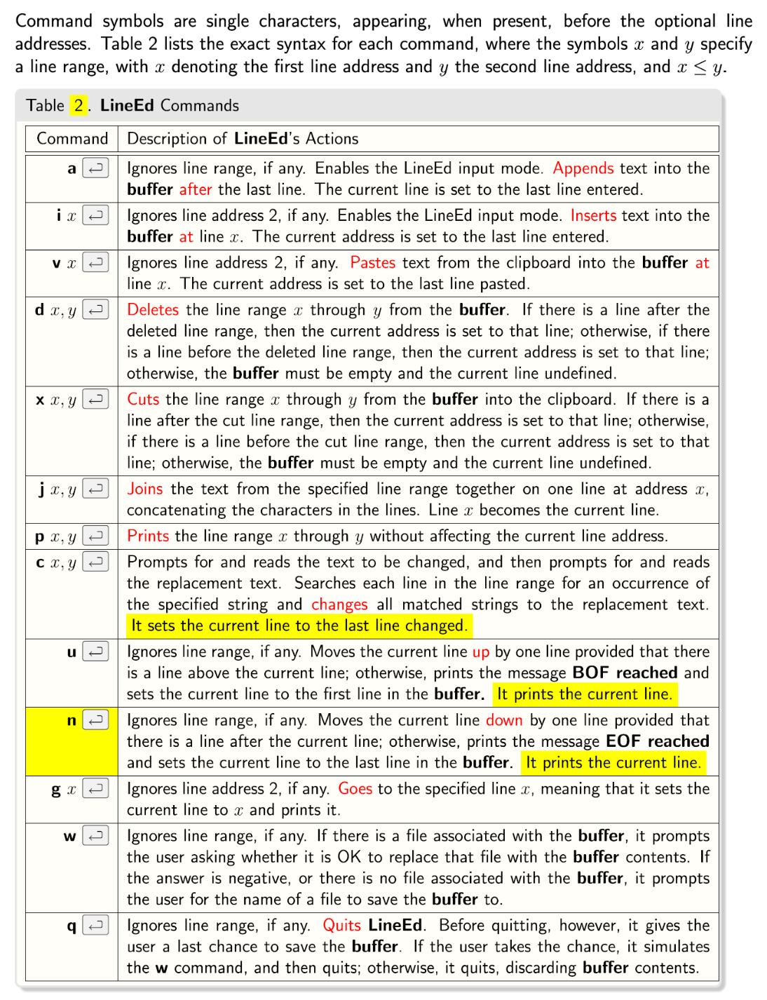

# Text-Editor
Led is a line oriented text editor that allows users to open, edit, and save new or existing files. Internally, led always operates on a buffer, a place in memory where it stores a copy of the file it is editing. if it is given an input file name at start, led loads the buffer with the content of that file, line by line; otherwise it creates an empty buffer.
To write out the buffer to the given file, the user must give w(write) command, any changes not explicitly saved are lost. In addition to a buffer, led also uses a clipboard, a place in memory where it stores the lines cut out of the buffer through a cut(x) command.

# Commands

